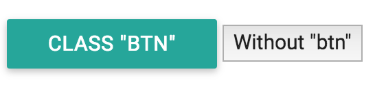
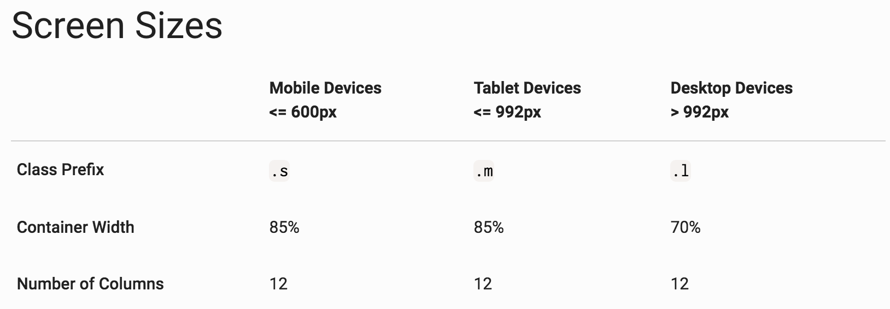

# Module 8: Responsive CSS

## Overview
Given the prominence of mobile devices and tablets for internet usage, it's crucial that the websites that we build are engineered to look beautiful and work well on small devices. This module covers the skills necessary to begin implementing a **mobile-first** approach to web development. This approach assumes an initial build towards a mobile device, which is **progressively enhanced** on larger screens.

<!-- START doctoc generated TOC please keep comment here to allow auto update -->
<!-- DON'T EDIT THIS SECTION, INSTEAD RE-RUN doctoc TO UPDATE -->

**Contents**

- [Resources](#resources)
- [Media Queries](#media-queries)
- [Flexbox](#flexbox)
- [CSS Frameworks](#css-frameworks)
  - [The Grid](#the-grid)

<!-- END doctoc generated TOC please keep comment here to allow auto update -->

## Resources
- [w3schools Media Queries](http://www.w3schools.com/css/css_rwd_mediaqueries.asp)
- [Guide to Flexbox](https://css-tricks.com/snippets/css/a-guide-to-flexbox/)
- [Flexbox Froggy!](http://flexboxfroggy.com/)
- [Media "screen" interpretation](http://stackoverflow.com/questions/8549529/what-is-the-difference-between-screen-and-only-screen-in-media-queries)

## Media Queries
In order to build websites that work well across devices, you need to be able to conditionally change the style given the size of the screen (or browser window). Depending on the type and volume of content of your webpage, you may want to change the size, color, layout, or any other visual properties. To accomplish this, we use **media queries** to determine the size of the screen, and apply specific styles. In your CSS, you can use the `@media` syntax to assign styles under certain conditions:


```css
@media screen and (min-width:992px) {
  /* Assign multiple styles in here for screens larger than 991px */
  #element-1 {
    font-size:10px;
  }

  .klass-1 {
    font-size:20px;
  }
}
```

The above media query reads: _on a device with a **screen** whose width is **greater than or equal to** 992px, assign the following styles_. Because our primary styles will target a **small device**, we will most often use the `min-width` rule to conditionally assign styles to **larger devices**.

As you can see, you can make **multiple selections** to assign styles to different elements given a set of media rules. You can also write a variety of media rules to target varying device sizes:

```css
/* These rules are applied by default */

@media screen and (min-width:768px) {
  /* These rules are applied for devices greater than or equal to 768 */
}

@media screen and (min-width:992px) {
  /* These rules are applied for devices greater than or equal to 992 */
}
```
Obviously, if a device width is greater than 992px, it is _also_ greater than 768px. Luckily, your browser is intelligent enough to apply the styles to the more specific CSS selector (992px), which is what you want to happen.

To practice writing media queries, see [exercise-1](exercise-1).

## Flexbox
The **Flexbox** layout mode, introduced in CSS3, provides a simple syntax for distributing items within a container. While it is certainly possible to achieve the same layouts _without_ using a flexbox display, the layout provides a variety of advantages, such as **matching the vertical heights** of child items. In this section, we'll cover some of the basics of using Flexbox layouts.

### Box-sizing
Before we can dive into using flexbox, it's important to understand how your web-browser sizes elements (this is particularly important for aligning items). As you know, each HTML element's size can be understood using the box model, in which every elements has some amount of **content**, **padding** between the content and its **border**, and **margin** to put space between elements. However, when you're assigning a size such as `width`, HTML _**does not**_ (by default) include the padding or border in the size of the elements.

To adjust this, we simply want to set the `box-sizing` property to `border-box`. This _includes_ the padding and border in the size of each element, making it easier to more accurately descrie the desired size of your items. It's common to apply this style to _all_ elements on your webpage, which you can easily do using the `*` selector:

```css
* {
  box-sizing:border-box
}
```

### Structure
To implement a flexbox layout, you'll create a flexbox **container**, and place multiple **items** inside that container. For example:

```html
<div class="flex-container">
    <div class="flex-item">
        <h2>Column 1</h2>
        <p>...</p>
    </div>
    <div class="flex-item">
        <h2>Column 2</h2>
        <p>...</p>
    </div>
    <div class="flex-item">
        <h2>Column 3</h2>
        <p>...</p>
    </div>
</div>
```
```css
.flex-container {
  display:flex; /* Set the display to flex! */
}

.flex-item {
  flex-basis:25%;
}

```
The purpose of the flexbox layout (`display:flex;`) is to manipulate the layout of _child elements_ within the _container_. The flexbox style is **does not** affect anything _outside_ of the container, or _inside_ of the child items. Instead, it simply arranges the items inside of the container.

In the above example, each item with class `.flex-item` is set to take up 25% of the width of the flex-container. While we could have used `width` instead of `flex-basis` in the example above, `flex-basis` is far more [extensible](http://stackoverflow.com/questions/34352140/what-are-the-differences-between-flex-basis-and-width).

Here are a few additional properties you may want to apply to your flexbox **container** to configure the layout of your **items**:

- `justify-content`: Horizontally distribute items in your flexbox container, at the start (`flex-start`), end (`flex-end`), or center (`flex-center`) of the container. You can also add space around (`space-around`) or between (`space-between`) items.
- `align-items`: Vertically distribute items in your flexbox container, to fill the container (`stretch`), at the start or end of the container (`flex-start`, `flex-end`), in the vertical center (`center`) or at the bottom of the container (`bottom`)
- `flex-wrap`: Wrap items onto a new line if necessary (`wrap`, `nowrap`, or `wrap-reverse`)

Based on these (and a few other) properties, your browser will compute the optimal layout for the items within your flexbox.

### Flexbox and Media Queries
While it is possible to leverage flexbox to change the number of items in a given row, you will still need to use media queries to gain full control over your layout across devices. The most common change you'll want to make is adjusting the amount of width taken up by each flex item by adjusting the `flex-basis` property. This is easily implemented using media queries:

```css
/* Have each item take up 100% of the flexbox-container */
.flex-item {
  flex-basis:100%;
}

/* On larger screens, have each item take up 25% of the width */
@media screen and (min-width:768px) {
  .flex-item {
    flex-basis:25%;  
  }
}
```
Note the **mobile-first** approach used in the code section above: the default properties describe rendering on a small device, while the large device properties (`flex-basis:25%`) are assigned using a media query.

To experiment with flexbox, checkout [flexboxfroggy](http://flexboxfroggy.com/), or see [exercise-2](exercise-2).

## CSS Frameworks
A CSS framework is a pre-written set of CSS files that apply styles to your elements. Even for basic tasks, it makes sense to use a CSS framework to structure your code. They are particularly useful for making sites responsive based on screen size, which we'll describe below.

Two of the most popular frameworks are [Bootstrap](http://getbootstrap.com/), developed by Twitter, and Materialize, whose design was _inspired by_ the [material design[(http://materializecss.com/about.html)] principles championed by Google. Both of these framewoks leverage similar concepts (most importantly, laying out elements in responsive **grids**), and provide default styles for common HTML elements, such as buttons, dropdown menus, headers, footers, etc. In this module, we'll describe the use of Materialize, but the approach to using Bootstap (and many other frameworks) is nearly identical.

There are [dozens](http://www.awwwards.com/what-are-frameworks-22-best-responsive-css-frameworks-for-web-design.html) of available frameworks, but the important thing is that you choose one that you like, and can build on the work of others.

To use a CSS framework, you simply read the file(s) into the head section of your .html file. Note, some frameworks leverage JavaScript files for more advanced interactivity -- these are only required for certain elements (such as modals, which are like fancy dialog boxes) to render properly:

<head>
  <!-- Compiled and minified CSS -->
  <link rel="stylesheet" href="https://cdnjs.cloudflare.com/ajax/libs/materialize/0.97.5/css/materialize.min.css">

  <!-- Compiled and minified JavaScript -->
  <script src="https://cdnjs.cloudflare.com/ajax/libs/materialize/0.97.5/js/materialize.min.js"></script>
</head>

Once you have loaded a framework, you will want to assign the appropriate _classes_ to your HTML elements to apply the pre-written styles. For example, assiging a `<button>` element class `btn` will apply your styles (assuming you have loaded the framework, of course):



### The Grid
While you can write media queries yourself, it can be easier (and more consistent) to leverage the pre-defined styles that are written in the CSS files of your framework. Both bootstrap and materialize allow you to create a grid system to arrange elements on the screen. The premise is that a **row** takes up the width of your screen, and is always 12 **columns** wide. Then, you can apply a pre-defined set of CSS classes to describe _how many columns_ you want an element to occupy given a certain screen size. Here is the table of screen sizes for each class for the Materialize framework:



For example, you could apply a class size of `col s12` to have an element take up 12 columns on a _small_ screen. You can also describe multiple classes to declare different layouts for different screen sizes:

```html
<!-- Container div with pre-set styles from Materialize -->
<div class="container">
  <!-- A row for your grid -->
  <div class="row">
    <!-- An element that will take up:
      - 12 columns on a small screen (<=600px),
      - 6 columns on a medium screen (<=992px), and
      - 4 columns on a large screen (>992px)
    -->
    <div class="col s12 m6 l4">...</div>
  </div>
</div>
```
Under the hood, materialize is (of course) using media queries to describe different behaviors at different screen sizes (there's no magic here).

For practice using the grid system and Materialize framework, see [exercise-3](exercise-3).
